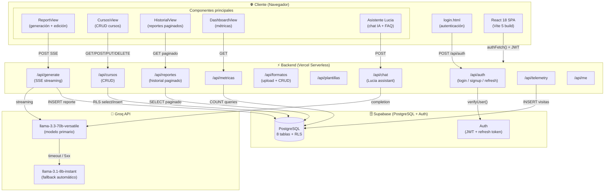

# Arquitectura Técnica — DocuIA

## Diagrama de componentes



---

## Stack tecnológico y justificación

| Capa | Tecnología | Justificación |
| --- | --- | --- |
| **Frontend** | React 18 + Vite 5 | SPA rápida, hot-reload, build optimizado para producción; sin framework pesado |
| **Estilos** | CSS variables nativas | Cero overhead de CSS-in-JS; dark mode con una variable `--bg`; fácil de mantener |
| **Animaciones** | Anime.js v4 | Librería liviana (~14 KB) con API declarativa; evita CSS keyframes repetitivos |
| **Backend (dev)** | Express 4 | Servidor local simple para proxying; descartado en producción |
| **Backend (prod)** | Vercel Serverless | Escala a cero, free tier generoso, deploys automáticos desde GitHub |
| **Base de datos** | Supabase (PostgreSQL) | BD relacional con Auth incluida, RLS nativo, SDK JS, free tier de 500 MB |
| **IA generativa** | Groq API (LLaMA 3.3 70B) | Inferencia ~10× más rápida que OpenAI en modelos equivalentes; free tier |
| **Auth** | Supabase Auth + JWT | Sin infraestructura propia de auth; refresh token gestionado por el cliente |
| **Generación .docx** | docx + docxtemplater | Genera Word nativo para que los docentes puedan editar offline |
| **Preview en browser** | docx-preview | Muestra el Word antes de descargar, sin conversión a PDF |

---

## Estrategia de seguridad

### Autenticación y autorización
- **JWT HttpOnly cookies** para el token de sesión (migrado en commit `d749986`).
- **Refresh token** gestionado automáticamente en `src/utils/auth.js` con `authFetch()` (retry transparente ante 401).
- **RLS en Supabase:** cada tabla tiene políticas que filtran por `auth.uid() = user_id`; un usuario nunca puede leer datos de otro.
- **Service role key** solo en el servidor (variables de entorno Vercel); el cliente solo recibe la `anon key`.

### Protección de APIs
- **Rate limiting:** 45 generaciones/usuario/hora verificadas contra la tabla `reportes` en Supabase (persistente en serverless) + 120/IP/hora en memoria.
- **Sanitización de prompts:** el endpoint `/api/generate` elimina patrones de inyección (`System:`, `Ignore previous`, `[INST]`) antes de enviar a Groq.
- **System prompt 100% server-side:** el cliente solo envía datos del formulario; el prompt de instrucciones nunca sale del servidor.

### Cabeceras HTTP
Configuradas en `vercel.json` y `lib/server/securityHeaders.js`:
- `Content-Security-Policy` (CSP) — restringe fuentes de scripts, estilos e imágenes
- `X-Frame-Options: DENY` — previene clickjacking
- `X-Content-Type-Options: nosniff`
- `Strict-Transport-Security` (HSTS) — fuerza HTTPS

### Variables de entorno
Nunca subidas al repositorio. Documentadas en el README (sección "Variables de entorno"). Gestionadas en Vercel Dashboard para producción y en `.env` local para desarrollo (excluido por `.gitignore`).

---

## Flujo principal: generación de un informe

```
Docente rellena formulario
    │
    ▼
src/config.js → buildPrompt()  [datos del formulario → texto estructurado]
    │
    ▼ POST /api/generate (JWT en cookie)
    │
lib/server/verifyUser.js → verifica JWT con Supabase
    │
lib/server/rateLimit.js → verifica cuota (45/usuario/hora)
    │
Sanitización del prompt (elimina inyecciones)
    │
Groq API → llama-3.3-70b-versatile (streaming SSE)
    │  ← timeout 30s o error 5xx? → llama-3.1-8b-instant
    │
INSERT en tabla reportes (Supabase)
    │
    ▼
ReportView.jsx recibe chunks SSE → renderiza en tiempo real
    │
Docente edita, descarga .docx o copia texto
```

---

## Archivos clave

| Archivo | Rol |
| --- | --- |
| `src/config.js` | REPORT_TYPES, FORM_FIELDS, buildPrompt(), SYSTEM_PROMPT |
| `api/generate.mjs` | Endpoint principal de generación (streaming SSE, rate limit, Groq) |
| `api/auth.js` | Login, signup, refresh token, recuperación de contraseña |
| `lib/server/verifyUser.js` | Middleware de verificación JWT para todos los endpoints protegidos |
| `lib/server/rateLimit.js` | Rate limiting persistente (Supabase) + in-memory |
| `src/utils/auth.js` | authFetch() — wrapper con refresh automático de token |
| `src/utils/download.js` | Exportación Word / PDF / CSV desde el frontend |
| `database/schema.sql` | Schema completo de la base de datos (CREATE TABLE + RLS) |
| `vercel.json` | Configuración de Vercel: rewrites, CSP headers, serverless config |
